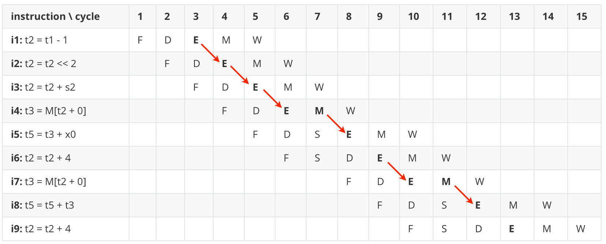
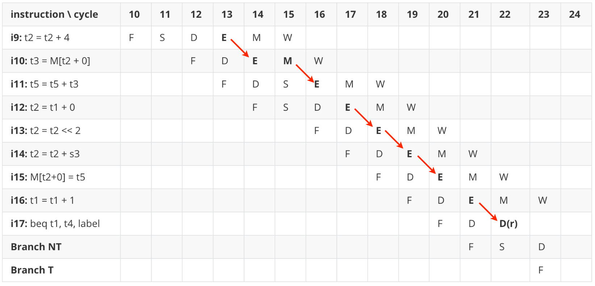
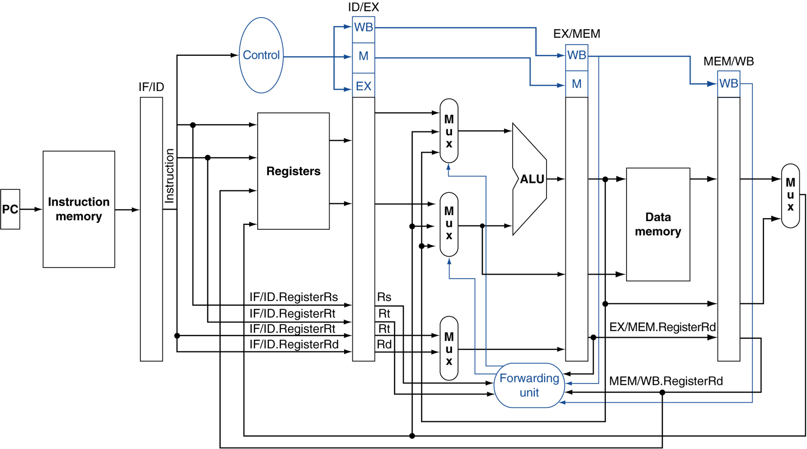
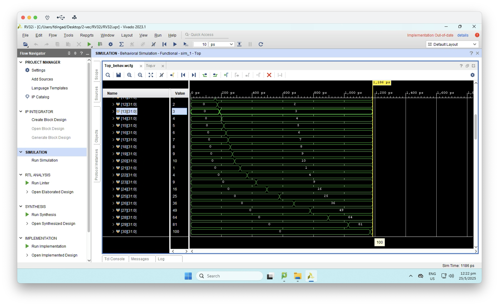
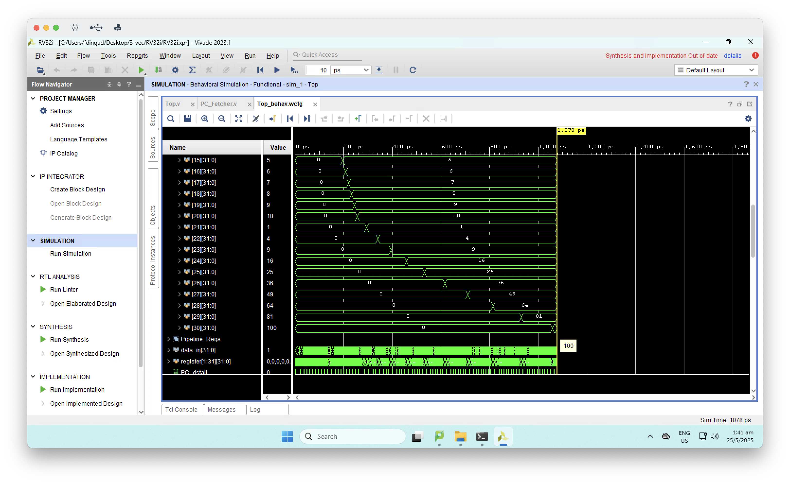
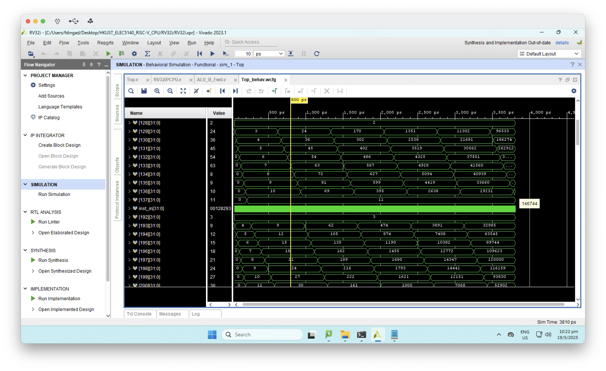
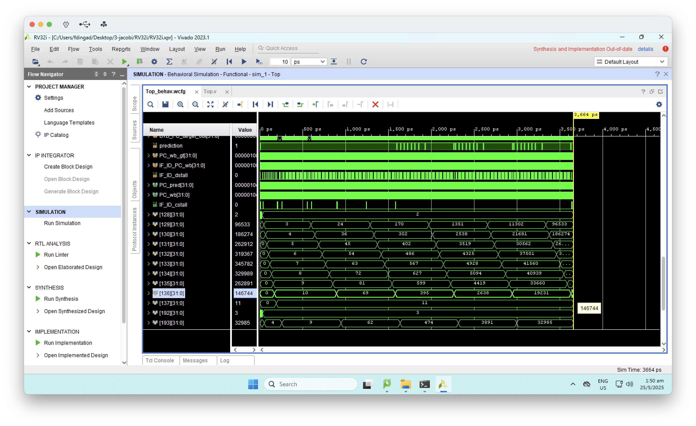

[toc]

# ELEC 5140 project 2: RISC-V CPU with data forwarding and branch prediction

By: DING Fangyu, E-mail: fdingad@connect.ust.hk 


This course project of **HKUST ELEC 5140 - Advanced Computer Architecture** is based on the [RISC-V_CPU](https://github.com/RipperJ/RISC-V_CPU/tree/main). The baseline is a single-issue 5-stage **RISC-V** processor without data forwarding and branch prediction, which may cause the issues of data hazard and control hazard.

In this project, the baseline processor is enhanced with data forwarding mechanism and branch prediction, to deal with these 2 types of hazard. By adopting these 2 micro-architecture optimizations, we finally obtain 1.57x and 1.96x speedups on 2 benchmark RISC-V assembly programs [Vec-Mul](https://github.com/dingfangyu/HKUST_ELEC5140_RISC-V_CPU/tree/main/tests/Vec_Mul) and [Jacobi-1d](https://github.com/dingfangyu/HKUST_ELEC5140_RISC-V_CPU/tree/main/tests/jacobi-1d), respectively.

This project is implemented by incorporating an additional 1153 lines of Verilog code into the baseline project [RISC-V_CPU](https://github.com/RipperJ/RISC-V_CPU/tree/main). The simulations are done by Vivado on the HKUST server (vdi.ust.hk) through Omnissa Horizon Client. The source code is available at https://github.com/dingfangyu/HKUST_ELEC5140_RISC-V_CPU.


## Data Hazard and Data Forwarding

There are many types of data hazards, i.e. RAW, WAW, WAR. In this project, we focus on the real data hazard: RAW hazard. 

### Problem Statement

In the Jacobi benchmark program, we have assembly code snippet as follow:

```assembly
k_loop_i1:
addi t2, t1, -1
slli t2, t2, 2
add t2, t2, s2
lw t3, 0(t2)
add t5, t3, x0
addi t2, t2, 4
lw t3, 0(t2)
add t5, t5, t3
addi t2, t2, 4
lw t3, 0(t2)
add t5, t5, t3

addi t2, t1, 0
slli t2, t2, 2
add t2, t2, s3
sw t5, 0(t2)
addi t1, t1, 1
bne t1, t4, k_loop_i1
```

whose corresponding C code is:

```c
for (int i = 1; i < 9; i++) {
    B[i] = A[i-1]+A[i]+A[i+1];
}
```

We can draw the pipeline time chart as follow:





where red arrows are the forwarding paths. In this example, we have data forwardings like E->E, M->E, and E->r (which is actually E->D). When a register value is available, we can forward it to the register values **required** in stages **E** (e.g. for R-type ALU operations or I-type load operations) or **D** (e.g. for branch instructions) from pipeline buffers **M/W** or **E/M**, which contain the **produced** values after the **M** stage (notably, the producer instruction can be load or ALU) or the **E** stage (ALU).


### Forwarding Unit

Therefore, the cases of data forwarding are:

- M/W buffer's written reg value && M/W producer inst is load -> E's read reg value
- M/W buffer's written reg value && M/W producer inst is ALU -> E's read reg value
- E/M buffer's written reg value && E/M producer inst is ALU -> E's read reg value
- M/W buffer's written reg value && M/W producer inst is load -> D's read reg value
- M/W buffer's written reg value && M/W producer inst is ALU -> D's read reg value
- E/M buffer's written reg value && E/M producer inst is ALU -> D's read reg value

There are totally **6 cases**, which are implemented in [Forwarding_Unit.v](https://github.com/dingfangyu/HKUST_ELEC5140_RISC-V_CPU/blob/main/RV32i/RV32i.srcs/sources_1/new/Forwarding_Unit.v). The load/ALU operation classification can be done by inspecting the signal **DatatoReg**, which determinates where the required data comes from (i.e. memory or ALU).

**The datapath of forwarding unit** 



This figure (from HKUST ELEC 5140 slides) illustrates the datapath of forwarding unit, which only contains a special case: forwarding to E's ALU inputs. As we have analyzed, we can also forward to **1)** D's ALU inputs for branch decision or **2)** register value for E's memory address in operations like load or store where the read register is not an input to E's ALU.


### Data Stall

In addition to the forwarding unit, we also need a Data Stall module to decide when to stall, which should be done in D stage. 

In the baseline, its [Data_Stall.v](https://github.com/RipperJ/RISC-V_CPU/blob/main/RV32i/RV32i.srcs/sources_1/new/Data_Stall.v) stalls (the updates of PC, F/D, and D/E) when the read registers in D stage are writing by other instructions (in their E or M) until the last cycle (W) of other instructions.

However, with data forwarding, the data stall mechanism should be different, only when in the following cases we do need to stall:

- D's inst is not branch && E's inst is load && E's inst will write D's registers to read
  - M->E load-use hazard in non-branch instructions
- D's inst is branch && E's inst will write D's registers to read
  - E->D, M->D in branch instructions

We have implemented this data stall mechanism in our [Data_Stall.v](https://github.com/dingfangyu/HKUST_ELEC5140_RISC-V_CPU/blob/main/RV32i/RV32i.srcs/sources_1/new/Data_Stall.v).


## Control Hazard and Branch Prediction

### Problem Statement

The abstrated branch behavior in the pipeline time chart is:

| instruction \ cycle        | 0    | 1    | 2    | 3    | 4    |      |      |      |      |      |      |      |      |      |      |
| -------------------------- | ---- | ---- | ---- | ---- | ---- | ---- | ---- | ---- | ---- | ---- | ---- | ---- | ---- | ---- | ---- |
| **i17:** beq t1, t4, label | F    | D(r) |      |      |      |      |      |      |      |      |      |      |      |      |      |
| **Branch NT (i18)**        |      | F    | D    |      |      |      |      |      |      |      |      |      |      |      |      |
| **Branch T (i1)**          |      |      | F    |      |      |      |      |      |      |      |      |      |      |      |      |

In the above program, if the branch is taken (T),  **i18** is wasted and flushed, the new instruction **i1** starts in cycle 2. The motivation is, if we can predict the branch behavior (T/NT), then we can set **i18** as the predicted instruction. If we predict correctly, then it is not wasted and 1 cycle can be saved.

### Branch Prediction

**Branch Target Buffer (BTB)**

To implement a branch predictor, first we need a branch target buffer (BTB) to record whether a PC is a branch instruction, and where is its target PC if it is a branch instruction. We implemented it in [Branch_Target_Buffer.v](https://github.com/dingfangyu/HKUST_ELEC5140_RISC-V_CPU/blob/main/RV32i/RV32i.srcs/sources_1/new/Branch_Target_Buffer.v).

Notably, BTB reading is performed in **F** stage for a PC, and BTB writing is in **D** stage when the instruction is decoded.

**Global History**

To utilize the global branch history, we also implement [Global_History.v](https://github.com/dingfangyu/HKUST_ELEC5140_RISC-V_CPU/blob/main/RV32i/RV32i.srcs/sources_1/new/Global_History.v) to record the branch history information in a global history register (GHR), which is updated each time a branch is resolved in D stage.

**Branch Predictor**

Based on BTB and GHR, we are able to index the branch predictor (BP) for each combination of PC and GHR values. Also, BP reading is in F stage, and BP writing is in D stage. We have implemented BP in [Branch_Predictor.v](https://github.com/dingfangyu/HKUST_ELEC5140_RISC-V_CPU/blob/main/RV32i/RV32i.srcs/sources_1/new/Branch_Predictor.v).


### Control Stall

**PC Fetcher**

Most importantly, we use all the above modules to decide which PC to fetch (by setting PC_wb) in the next cycle. The kernel code of [PC_Fetcher.v](https://github.com/dingfangyu/HKUST_ELEC5140_RISC-V_CPU/blob/main/RV32i/RV32i.srcs/sources_1/new/PC_Fetcher.v) is:

```verilog
always @ (*) begin

    IF_ID_cstall = 0;

    if (BTB_is_Branch_out && prediction) PC_pred = BTB_PC_target_out;
    else PC_pred = PC_query + 32'b0100;

    PC_wb = PC_pred;

    if (IF_ID_PC_wb != 0 && IF_ID_dstall == 0) begin 
        if (IF_ID_PC_wb == PC_wb_gt) begin 
            // nothing
        end else begin 
            IF_ID_cstall = 1;
            PC_wb = PC_wb_gt; 
        end 
    end 
end 
```

In this module, we also set the cstall signal, to flush the wrong predicted instructions and correct PC_wb with the PC_wb_gt resolved in D stage, while in the baseline cstall is set in [Control_Stall.v](https://github.com/dingfangyu/HKUST_ELEC5140_RISC-V_CPU/blob/main/RV32i/RV32i.srcs/sources_1/new/Control_Stall.v).


## Experimental Results

### Clock Cycles

| Benchmarks\Approaches | baseline | + data forwarding | + branch predictor |
| --------------------- | -------- | ----------------- | ------------------ |
| Vec-Mul               | 1700     | 1186              | 1078               |
| Jacobi-1d             | 7170     | 3810              | 3664               |

### Speedup

| Benchmarks\Approaches | baseline | + data forwarding | + branch predictor |
| --------------------- | -------- | ----------------- | ------------------ |
| Vec-Mul               | 1        | 1.43              | 1.57               |
| Jacobi-1d             | 1        | 1.88              | 1.96               |

### Vivado Simulation

**Vec-Mul (data forwarding, 1186 cycles)**



**Vec-Mul (data forwarding & branch predictor, 1078 cycles)**



**Jacobi-1d (data forwarding, 3810 cycles)**



**Jacobi-1d (data forwarding & branch predictor, 3664 cycles)**


